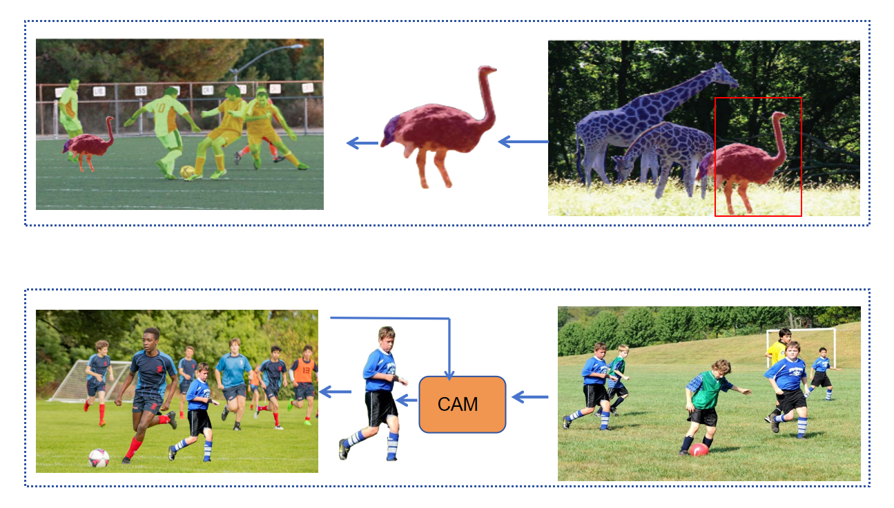

# Context-Aware Crop-Paste Data Augmentation

## Introduction
In this repository, we propose a VLM based approach to 
implement context-aware data augmentation. It leverages
BLIP and Bert to connect the base image and target image gallery,
select best matched target obj and crop-paste it onto the
base image.
## Usage
If you want to augment your base_img with your given
target image, use mode custom:
`python demo.py custom base_img_path tar_img_path`
otherwise, use mode obj365:
`python demo.py obj365 base_img_path`
## Methods

